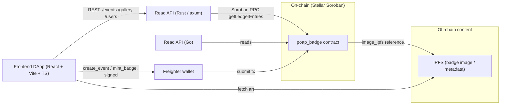

# hack-meridian

A POAP-style event-badge dApp on Stellar Soroban. Organizers register events and mint immutable, verifiable participation badges on-chain; a Rust read API, an optional Go read API, and a React DApp consume the contract, with badge art stored off-chain on IPFS.

[](https://github.com/fabricioguidine/hack-meridian/actions/workflows/ci.yml) [](LICENSE) [](https://www.rust-lang.org)

Each badge proves attendance at an event or completion of a course; per-user badge counts feed a gamification layer. The on-chain contract holds events, ownership, and IPFS references; rich content (image/attributes) lives off-chain on IPFS.

## Components

- **`poap_badge` contract (Soroban / Rust)** — the source of truth. Registers events (`create_event`, organizer-authorized, rejecting duplicate ids), mints badges (`mint_badge`, organizer-only, rejecting double-mint), and exposes ownership/gallery reads. Module layout: `lib.rs` (`#[contractimpl]` surface + `require_auth`), `event.rs`, `badge.rs`, `storage.rs` (typed `DataKey`), `types.rs`, `error.rs`, `test.rs`.
- **Read API (Rust / axum)** — `backend/`, serves `/health`, `/events`, `/events/:id`, `/events/:id/owners`, `/users/:account/badges`, `/gallery` by reading decoded contract state over Soroban RPC (`getLedgerEntries`, no signing).
- **Read API (Go)** — `backend-go/`, a parallel read API for language comparison.
- **React DApp** — `frontend/`, gallery, event detail, "My Badges" collection, and an organizer panel that signs `create_event` / `mint_badge` through the Freighter wallet.
- **Scripts** — `scripts/deploy.sh` (Stellar CLI deploy), `scripts/seed.sh` (seed demo events), `scripts/pin_ipfs.py` (pin art to IPFS via Pinata).

## Architecture

The contract is authoritative. Backends read decoded contract state over Soroban RPC; the DApp reads through the backend and writes to the contract through a wallet.



### Contract public API

| Function | Auth | Description |
|---|---|---|
| `create_event(event_id, organizer, name, description, image_ipfs)` | organizer | Registers an event; fails with `EventAlreadyExists`. |
| `mint_badge(event_id, recipient)` | event organizer | Issues the badge; fails with `EventNotFound` / `BadgeAlreadyMinted`. |
| `has_badge(event_id, user) -> bool` | — | Whether `user` holds the event badge. |
| `list_user_badges(user) -> Vec<BytesN<32>>` | — | Event ids a user owns. |
| `total_badges(user) -> u32` | — | Badge count (gamification). |
| `list_event_owners(event_id) -> Vec<Address>` | — | Collectors of an event's badge. |
| `list_events() -> Vec<BytesN<32>>` | — | All registered events. |
| `list_all_badges() -> Vec<BadgeInfo>` | — | Every event with its metadata. |
| `get_event(event_id) -> EventMetadata` | — | Event metadata; fails with `EventNotFound`. |

## Requirements

- **Rust toolchain (edition 2021).** Building the deployable wasm needs the `wasm32-unknown-unknown` target.
- **soroban-sdk 23** for the contract; **axum 0.7 / tokio / reqwest / stellar-xdr 22** for the backend (see `backend/Cargo.toml`).
- **Node.js 20+** for the frontend DApp (React 18 + Vite 5 + TypeScript), with `@stellar/stellar-sdk` and `@stellar/freighter-api`.
- **Go 1.24+** only for the optional `backend-go/` comparison API.
- **Stellar CLI** for deploy/seed scripts.
- Optional: **Docker** (per-component Dockerfiles + `docker-compose.yml`), a Soroban-RPC endpoint, and an IPFS pinning service for live use.

## Build & run

### Contract (`contracts/poap_badge`)

```bash
cd contracts/poap_badge
cargo test
rustup target add wasm32-unknown-unknown
cargo build --release --target wasm32-unknown-unknown
# artifact: target/wasm32-unknown-unknown/release/poap_badge.wasm
```

### Backend read API (`backend`, Rust / axum)

```bash
cd backend
cargo test
cargo build --release
CONTRACT_ID=C... cargo run --release   # CONTRACT_ID is required
```

Configuration is read from the environment: `SOROBAN_RPC_URL` (default `https://soroban-testnet.stellar.org`), `CONTRACT_ID` (required, deployed `C...` strkey), `PORT` (default `4000`).

### Frontend DApp (`frontend`, React + Vite + TS)

```bash
cd frontend
npm install
npm run dev        # http://localhost:5173
npm run build
npm run test
```

Configure `VITE_BACKEND_URL` (default `http://localhost:4000`), `VITE_CONTRACT_ID`, `VITE_SOROBAN_RPC_URL` (default `https://soroban-testnet.stellar.org`), and `VITE_NETWORK_PASSPHRASE` in `frontend/.env`.

### Deploy / seed (testnet)

`scripts/deploy.sh` (deploy via the Stellar CLI), `scripts/seed.sh` (seed demo events), and `scripts/pin_ipfs.py` (pin metadata to IPFS) cover a testnet run; see [`scripts/README.md`](scripts/README.md). Run `scripts/deploy.sh` with a funded testnet identity, then point `CONTRACT_ID` / `VITE_CONTRACT_ID` at the result.

### Docker

`docker-compose.yml` builds all components (`docker/*.Dockerfile`); set `CONTRACT_ID` in the environment before `docker compose up`.

## Project structure

```
hack-meridian/
├── contracts/poap_badge/   # Soroban contract (Rust) + tests
│   └── src/
│       ├── lib.rs          # #[contractimpl] surface + auth
│       ├── event.rs        # event creation / listing / gallery
│       ├── badge.rs        # mint / has_badge / list
│       ├── storage.rs      # typed DataKey + persistent storage
│       ├── types.rs        # EventMetadata, BadgeInfo
│       ├── error.rs        # contract error codes
│       └── test.rs         # unit + auth + e2e tests
├── backend/                # read API (Rust / axum) over Soroban RPC
├── backend-go/             # read API in Go (comparison)
├── frontend/               # DApp (React + Vite + TypeScript)
├── scripts/                # deploy / seed / IPFS-pin helpers
├── docker/                 # per-component Dockerfiles
├── docker-compose.yml
└── .github/workflows/      # ci.yml (contract + backends + frontend), deploy.yml
```

## License

MIT. See [LICENSE](LICENSE).
