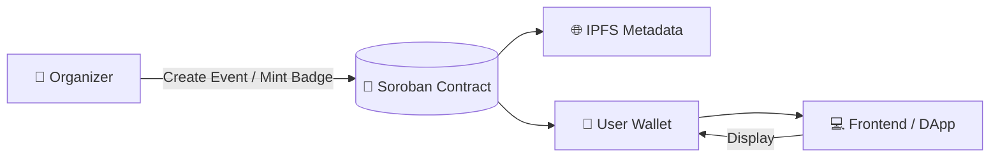
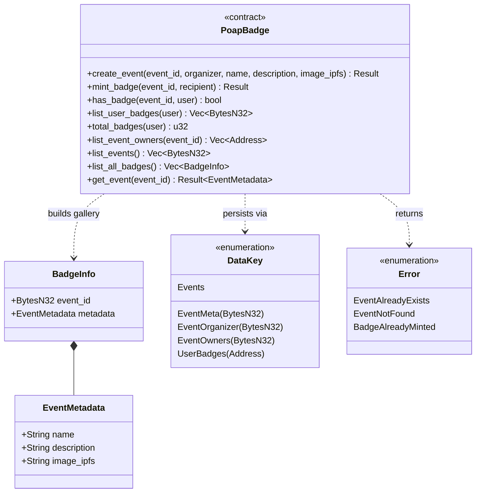
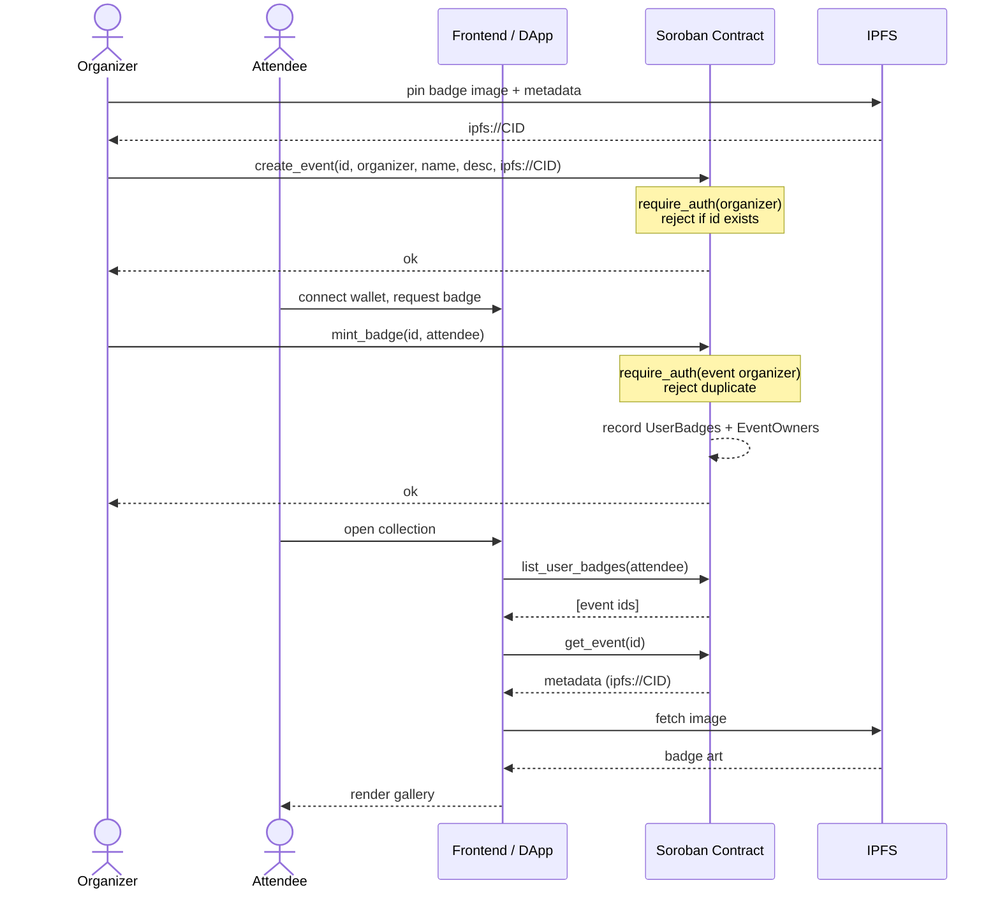
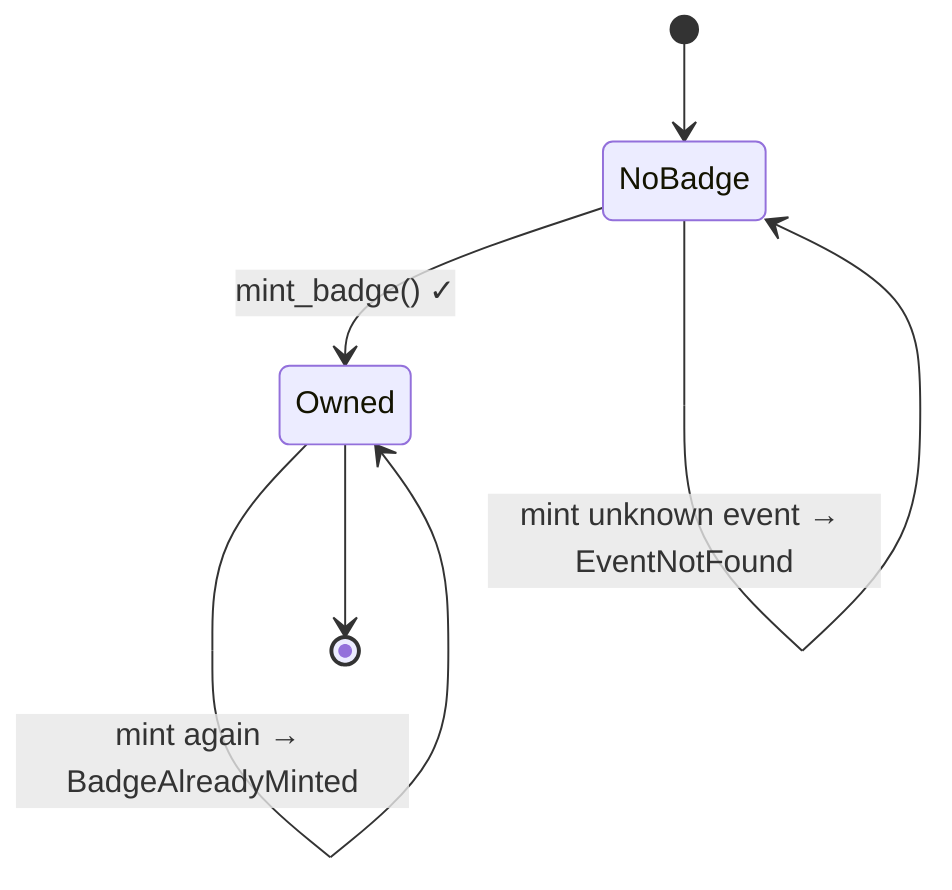

# Decentralized Badge System (POAP-like on Soroban)

[](https://github.com/fabricioguidine/hack-meridian/actions/workflows/ci.yml)

## 📖 Project Description

This project is a **decentralized badge system** built on the **Soroban smart contracts platform (Stellar network)**.  
It enables organizers to create **verifiable digital badges** (similar to NFTs) for events and online courses.  
Participants who attend an event or complete a course receive a **unique badge that proves their participation**.

The solution also incorporates **gamification and rewards**: collecting badges can unlock achievements, incentives, or recognition - motivating users to join more events and courses.  

- **Badges** are immutable, verifiable, and stored **on-chain**.  
- **Metadata** (name, description, images) is referenced via **IPFS**.  

This combination ensures both **trust** (blockchain verification) and **scalability** (off-chain content storage).

### ✅ In short, the project provides:

- **Transparency** → All participation is verifiable on-chain.  
- **Engagement** → Users are rewarded with badges and gamified incentives.  
- **Simplicity** → Organizers easily create events, mint badges, and track participants.  

---

## 🛠 Technologies Used

- **Rust + Soroban SDK** → Smart contract development (events, badges, storage).  
- **Stellar Soroban** → Blockchain network for deploying and executing contracts.  
- **IPFS** → Decentralized storage for metadata (badge details, images).  
- **Stellar/Soroban SDKs (frontend integration)** → Reading/writing data via wallets and DApps.  
- **Optional Python Backend** → For indexing, caching, and providing an API layer (not mandatory).  
- **Wallet Integration** → Enables users to claim badges and view them securely.
- **JavaScript** → Enables user interaction to the system.

---

## 📊 System Flow (simplified)



---

## 🧩 Smart Contract - `poap_badge`

The on-chain core lives in [`contracts/poap_badge`](contracts/poap_badge). Events are
identified by a `BytesN<32>` id (e.g. the hash of the event slug); rich content
(image, attributes) lives on IPFS and is referenced by `image_ipfs`.

### Public API

| Function | Auth | Description |
|---|---|---|
| `create_event(event_id, organizer, name, description, image_ipfs)` | organizer | Registers an event. Fails with `EventAlreadyExists` if the id is taken. |
| `mint_badge(event_id, recipient)` | event organizer | Issues the event badge to `recipient`. Fails with `EventNotFound` / `BadgeAlreadyMinted`. |
| `has_badge(event_id, user) -> bool` | - | Whether `user` holds the event badge. |
| `list_user_badges(user) -> Vec<BytesN<32>>` | - | Badges (event ids) a user owns. |
| `total_badges(user) -> u32` | - | Badge count - feeds the gamification layer. |
| `list_event_owners(event_id) -> Vec<Address>` | - | Collectors of an event's badge. |
| `list_events() -> Vec<BytesN<32>>` | - | All registered events. |
| `list_all_badges() -> Vec<BadgeInfo>` | - | Gallery: every event with its metadata. |
| `get_event(event_id) -> EventMetadata` | - | Event metadata. Fails with `EventNotFound`. |

### Errors

| Code | Variant |
|---|---|
| 1 | `EventAlreadyExists` |
| 2 | `EventNotFound` |
| 3 | `BadgeAlreadyMinted` |

### Module layout

```
contracts/poap_badge/src/
├── lib.rs       # contract surface (#[contractimpl]) + auth
├── event.rs     # event creation / listing / gallery
├── badge.rs     # mint / has_badge / list
├── storage.rs   # typed DataKey enum + persistent storage helpers
├── types.rs     # EventMetadata, BadgeInfo
├── error.rs     # contract error codes
└── test.rs      # unit + auth + end-to-end tests
```

---

## 🧱 UML

### Class diagram (domain model)



### Sequence - claim flow



### State - badge lifecycle (per attendee × event)



---

## 🚀 Build, test & deploy

```bash
cd contracts/poap_badge

# unit + e2e tests (11 tests)
cargo test

# build deployable wasm
rustup target add wasm32-unknown-unknown
cargo build --release --target wasm32-unknown-unknown
# artifact: target/wasm32-unknown-unknown/release/poap_badge.wasm
```

No local Rust toolchain? Build inside Docker (matches `docker/contracts.Dockerfile`):

```bash
docker run --rm -v "$PWD:/app" -w /app rust:1.86 cargo test
```

> Requires Rust **1.85+** (a transitive dependency uses edition 2024).

---

## 🧪 Proof of Concept (POC)

**Goal:** a live, demoable POAP loop on **Stellar testnet** - create an event, mint
to real wallets, and show the collection - provable end-to-end in a few minutes.

**Scope (in):**
1. Deploy `poap_badge` to Soroban **testnet** via the Stellar CLI.
2. Organizer script seeds 1–2 demo events (image pinned to IPFS via web3.storage/Pinata).
3. A minimal claim page: connect **Freighter** wallet → organizer mints → attendee
   sees the badge with its IPFS art.
4. A read-only gallery page calling `list_all_badges` / `list_user_badges`.

**Scope (out for the POC):** the optional indexer backend, mainnet, on-chain
royalties/transfers, and the self-claim (signed-attendance) flow - all noted below as
next steps.

**Demo script (90 seconds):**
`deploy → create_event("meridian-2025") → mint_badge(alice) → alice's gallery shows 1 badge → mint again → contract rejects (BadgeAlreadyMinted)`.

**Milestones:**
- **M1** - contract + wasm build + tests. ✅ done (`contracts/poap_badge`).
- **M2** - read API over Soroban RPC. ✅ done (`backend/`, Rust/axum).
- **M3** - DApp: gallery, collection, Freighter connect, organizer create/mint. ✅ done (`frontend/`, React).
- **M4** - testnet deploy + seed scripts + IPFS pin. ✅ scripted (`scripts/`); run against your funded key.
- **M5** - (stretch) self-claim with an organizer-signed claim code.

What remains to go *live* is operational, not code: run `scripts/deploy.sh` with a
funded testnet identity, then point `CONTRACT_ID` / `VITE_CONTRACT_ID` at the result.

### Backend

A read-only REST API is implemented in **Rust (axum)** under [`backend/`](backend) -
see [backend/README.md](backend/README.md). It reads contract state over Soroban RPC
(`getLedgerEntries`, no signing needed) and ships with 11 tests.

Language tradeoffs considered for the backend:

| Option | Verdict |
|---|---|
| **Rust** (`axum` + Soroban RPC) | ✅ Implemented - shares the domain model with the contract; reads decoded straight from on-chain ScVal. |
| **TypeScript** (`@stellar/stellar-sdk`) | ✅ Also strong - best-supported Soroban SDK, would share types with the frontend. |
| **Python** (`stellar-sdk`) | ✅ Good - mature, ergonomic. |
| **Go** (`stellar/go`) | ⚠️ Built for comparison ([`backend-go/`](backend-go)) - works for reads, but Horizon-oriented, no Soroban-RPC client, needs Go >= 1.24. |

### Frontend (DApp)

A React + Vite + TypeScript app under [`frontend/`](frontend), styled with the
extracted Stellar design tokens. It reads from the backend and writes to the
contract through Freighter:

- **Gallery** + **event detail** + **My Badges** - read via the backend API.
- **Organizer** - connect Freighter, `create_event` / `mint_badge` signed in-wallet.

```bash
cd frontend
npm install
npm run dev        # http://localhost:5173
npm run build && npm run test
```

Configure `VITE_BACKEND_URL`, `VITE_CONTRACT_ID`, `VITE_SOROBAN_RPC_URL` in
`frontend/.env` (see `.env.example`).

## Repository layout

| Path | What |
|---|---|
| `contracts/poap_badge` | Soroban contract (Rust) + tests |
| `backend` | Read API (Rust / axum) over Soroban RPC |
| `backend-go` | Same read API in Go (comparison) |
| `frontend` | DApp (React + Vite + TS) |
| `scripts` | Deploy / seed / IPFS-pin helpers ([scripts/README.md](scripts/README.md)) |
| `.github/workflows/ci.yml` | CI: contract + backend + frontend |

> The earlier `ctypes`/`.dylib` bridge was removed: a Soroban contract compiles to
> **wasm**, not a native shared library, so it can't be loaded via `ctypes`. Backends
> must talk to the deployed contract over **Soroban RPC**.
