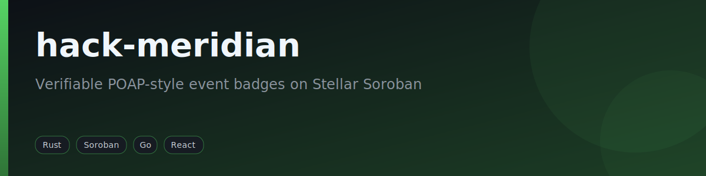
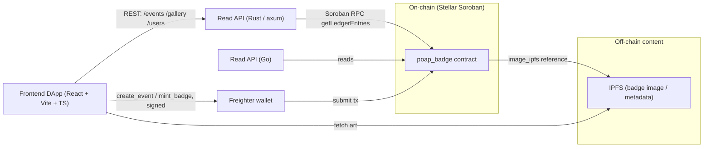
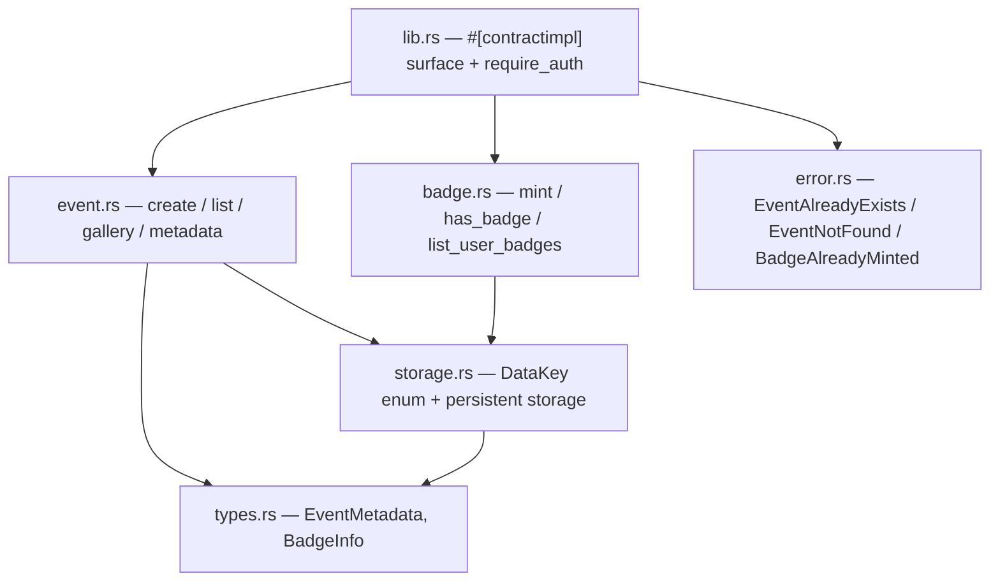

<div align="center">



[](https://github.com/fabricioguidine/hack-meridian/actions/workflows/ci.yml) [](https://www.rust-lang.org) [](https://soroban.stellar.org)

</div>

> A POAP-style, decentralized event-badge system on the Stellar Soroban smart-contract platform.

`hack-meridian` lets organizers register events and mint immutable, verifiable participation badges (POAP-like) on-chain. Each badge proves attendance at an event or completion of a course; collecting badges feeds a gamification layer (a per-user badge count). Rich content (image, attributes) lives off-chain on IPFS and is referenced from the on-chain event metadata, combining blockchain verifiability with scalable content storage. The repository is a hackathon project built around one Soroban contract (`poap_badge`) plus a read-only API and a DApp that consume it.

## Table of Contents

- [Features](#features)
- [Architecture](#architecture)
- [Requirements](#requirements)
- [Build & run](#build--run)
- [Project structure](#project-structure)
- [License](#license)

## Features

- **On-chain event registry** — `create_event` records an event (id, organizer, name, description, IPFS image), authorized by the organizer and rejecting duplicate ids (`EventAlreadyExists`).
- **Badge minting** — `mint_badge` issues an event's badge to a recipient; only the event organizer can mint, and double-minting is rejected (`BadgeAlreadyMinted`, `EventNotFound`).
- **Ownership & gamification reads** — `has_badge`, `list_user_badges`, `total_badges` (per-user count), `list_event_owners`.
- **Gallery reads** — `list_events`, `list_all_badges` (every event with metadata), `get_event` (single event metadata).
- **Read-only REST API (Rust / axum)** — exposes `/health`, `/events`, `/events/:id`, `/events/:id/owners`, `/users/:account/badges`, and `/gallery`, reading contract state over Soroban RPC (`getLedgerEntries`, no signing).
- **React DApp** — gallery, event detail, "My Badges" collection, and an organizer panel that signs `create_event` / `mint_badge` through the Freighter wallet.
- **Go backend** — a parallel read API (`backend-go/`) built for language comparison.
- **Deploy / seed / IPFS-pin scripts** — helpers under `scripts/` for testnet deployment.

## Architecture

The Soroban contract is the source of truth. Backends read decoded contract state over Soroban RPC; the DApp reads through the backend and writes to the contract through a wallet.



The contract is split into focused modules over a typed `DataKey` storage layer:



### Contract public API

| Function | Auth | Description |
|---|---|---|
| `create_event(event_id, organizer, name, description, image_ipfs)` | organizer | Registers an event; fails with `EventAlreadyExists`. |
| `mint_badge(event_id, recipient)` | event organizer | Issues the badge; fails with `EventNotFound` / `BadgeAlreadyMinted`. |
| `has_badge(event_id, user) -> bool` | — | Whether `user` holds the event badge. |
| `list_user_badges(user) -> Vec<BytesN<32>>` | — | Event ids a user owns. |
| `total_badges(user) -> u32` | — | Badge count (gamification). |
| `list_event_owners(event_id) -> Vec<Address>` | — | Collectors of an event's badge. |
| `list_events() -> Vec<BytesN<32>>` | — | All registered events. |
| `list_all_badges() -> Vec<BadgeInfo>` | — | Every event with its metadata. |
| `get_event(event_id) -> EventMetadata` | — | Event metadata; fails with `EventNotFound`. |

## Requirements

- **Rust toolchain (edition 2021).** The contract and backend crates declare `edition = "2021"`; building the deployable wasm needs the `wasm32-unknown-unknown` target. A transitive dependency uses edition 2024, so **Rust 1.85+** is recommended.
- **soroban-sdk 23** for the contract; **axum 0.7 / tokio / reqwest / stellar-xdr** for the backend (see `backend/Cargo.toml`).
- **Node.js 20+** for the frontend DApp (React + Vite + TypeScript).
- **Go 1.24+** only for the optional `backend-go/` comparison API.
- Optional: **Docker** (Dockerfiles per component + `docker-compose.yml`), a Soroban-RPC endpoint, and an IPFS pinning service for live use.

## Build & run

### Contract (`contracts/poap_badge`)

```bash
cd contracts/poap_badge

# unit + auth + end-to-end tests
cargo test

# build the deployable wasm
rustup target add wasm32-unknown-unknown
cargo build --release --target wasm32-unknown-unknown
# artifact: target/wasm32-unknown-unknown/release/poap_badge.wasm
```

No local toolchain? Build inside Docker (matches `docker/contracts.Dockerfile`):

```bash
docker run --rm -v "$PWD:/app" -w /app rust:1.86 cargo test
```

### Backend read API (`backend`, Rust / axum)

```bash
cd backend
cargo test
cargo build --release
CONTRACT_ID=C... cargo run --release   # CONTRACT_ID is required
```

Configuration is read from the environment (see `backend/.env.example`): `SOROBAN_RPC_URL` (default `https://soroban-testnet.stellar.org`), `CONTRACT_ID` (required, deployed `C...` strkey), `PORT` (default `4000`).

### Frontend DApp (`frontend`, React + Vite + TS)

```bash
cd frontend
npm install
npm run dev        # http://localhost:5173
npm run build
npm run test
```

Configure `VITE_BACKEND_URL`, `VITE_CONTRACT_ID`, `VITE_SOROBAN_RPC_URL` in `frontend/.env` (see `frontend/.env.example`).

### Deploy / seed (testnet)

`scripts/deploy.sh` (deploy via the Stellar CLI), `scripts/seed.sh` (seed demo events), and `scripts/pin_ipfs.py` (pin metadata to IPFS) cover a testnet run; see [`scripts/README.md`](scripts/README.md). Run `scripts/deploy.sh` with a funded testnet identity, then point `CONTRACT_ID` / `VITE_CONTRACT_ID` at the result.

## Project structure

```
hack-meridian/
├── contracts/poap_badge/   # Soroban contract (Rust) + tests
│   └── src/
│       ├── lib.rs          # #[contractimpl] surface + auth
│       ├── event.rs        # event creation / listing / gallery
│       ├── badge.rs        # mint / has_badge / list
│       ├── storage.rs      # typed DataKey + persistent storage
│       ├── types.rs        # EventMetadata, BadgeInfo
│       ├── error.rs        # contract error codes
│       └── test.rs         # unit + auth + e2e tests
├── backend/                # read API (Rust / axum) over Soroban RPC
├── backend-go/             # read API in Go (comparison)
├── frontend/               # DApp (React + Vite + TypeScript)
├── scripts/                # deploy / seed / IPFS-pin helpers
├── docker/                 # per-component Dockerfiles
├── docker-compose.yml
└── .github/workflows/      # ci.yml (contract + backends + frontend), deploy.yml
```

## License

No license file is present.
