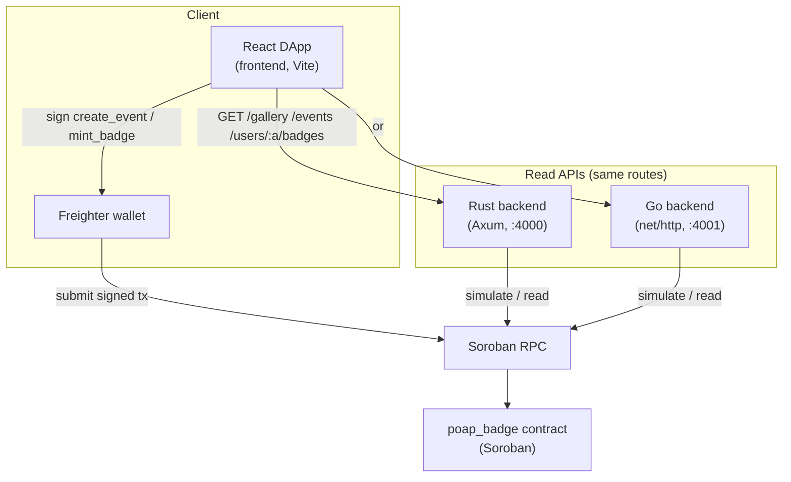

<div align="center">


[](https://www.rust-lang.org) [](https://developers.stellar.org/docs/build/smart-contracts) [](https://github.com/stellar/js-stellar-sdk) [](https://go.dev) [](https://github.com/fabricioguidine/hack-meridian/actions/workflows/ci.yml)

</div>

> Verifiable POAP-style event badges on Stellar Soroban.

`hack-meridian` is a proof-of-concept dApp for issuing and collecting POAP-style
(Proof of Attendance) badges on the Stellar Soroban smart-contract platform.
Organizers create events on-chain and mint immutable, verifiable badges to
attendees; rich content (image, attributes) is referenced via IPFS in the event
metadata. The project was built for the Stellar Meridian hackathon and targets
Soroban testnet.

The repository ships a Soroban smart contract plus two interchangeable read-only
HTTP backends (Rust and Go) that query the contract through Soroban RPC, and a
React DApp where organizers sign writes with the Freighter wallet.

## Table of Contents

- [Features](#features)
- [Architecture](#architecture)
- [Requirements](#requirements)
- [Build & run](#build--run)
- [Project structure](#project-structure)
- [License](#license)

## Features

- On-chain POAP badges: `create_event`, `mint_badge`, `has_badge`,
  `list_user_badges`, `total_badges`, `list_event_owners`, `list_events`,
  `list_all_badges`, `get_event` exposed by the `poap_badge` Soroban contract.
- Immutable badges with IPFS-referenced metadata (name, description,
  `image_ipfs`).
- Two read API implementations exposing the same routes: a Rust/Axum backend and
  a Go/`net/http` backend.
- React + Vite DApp with gallery, per-event detail, personal collection, and an
  organizer page that builds and submits Soroban transactions signed by
  Freighter.
- Helper scripts to deploy the contract and seed demo data via the Stellar CLI.
- Docker Compose stack for the contract builder, both backends, and the
  frontend.
- CI (`.github/workflows/ci.yml`) covering the contract, both backends, and the
  frontend; manual contract deploy via `.github/workflows/deploy.yml`.

## Architecture

The Soroban contract is the source of truth. The backends are read-only and call
Soroban RPC; the frontend reads through a backend and writes directly to the
contract via Freighter.



The contract organizes logic into modules: `event` (creation, metadata,
listing), `badge` (mint, ownership, per-user listing), `storage`, `types`, and
`error`. Both backends expose the same HTTP surface:

- `GET /health`
- `GET /events`
- `GET /events/:id`
- `GET /events/:id/owners`
- `GET /users/:account/badges`
- `GET /gallery`

## Requirements

- Rust toolchain (stable) with the `wasm32-unknown-unknown` target for the
  contract.
- [Stellar CLI](https://developers.stellar.org/docs/tools/cli) for building,
  deploying, and seeding the contract.
- Go 1.24+ for the Go backend.
- Node.js 20+ and npm for the frontend.
- Optional: Docker and Docker Compose for the full stack.
- A Freighter wallet for organizer writes in the DApp.

## Build & run

### Contract

```bash
cd contracts/poap_badge
cargo test
stellar contract build              # builds wasm32-unknown-unknown release wasm
```

Deploy to a network (defaults: identity `organizer`, network `testnet`):

```bash
stellar keys generate organizer --network testnet --fund
./scripts/deploy.sh                 # writes the contract id to .contract_id
./scripts/seed.sh                   # creates a demo event and mints a badge
```

### Rust backend (Axum)

```bash
cd backend
cargo test
CONTRACT_ID=C... cargo run          # listens on :4000 (PORT to override)
```

`CONTRACT_ID` is required. `SOROBAN_RPC_URL` (default
`https://soroban-testnet.stellar.org`) and `PORT` (default `4000`) are optional.
See `backend/.env.example`.

### Go backend (net/http)

```bash
cd backend-go
go test ./...
CONTRACT_ID=C... go run .           # listens on :4001 (PORT to override)
```

Same environment variables as the Rust backend; default `PORT` is `4001`.

### Frontend (React + Vite)

```bash
cd frontend
npm ci
npm run dev                         # Vite dev server
npm run build                       # tsc -b && vite build
npm run test                        # vitest run
```

Configure `frontend/.env` from `frontend/.env.example`: `VITE_BACKEND_URL`,
`VITE_CONTRACT_ID`, `VITE_SOROBAN_RPC_URL`, `VITE_NETWORK_PASSPHRASE`.

### Docker Compose

```bash
CONTRACT_ID=C... docker compose up --build
```

Brings up the contract builder, the Rust backend (`:4000`), the Go backend
(`:4001`), and the frontend (`:3000`). `CONTRACT_ID` must be set.

## Project structure

```
.
├── contracts/poap_badge/   # Soroban POAP badge contract (Rust, no_std)
├── backend/                # Rust read API (Axum)
├── backend-go/             # Go read API (net/http)
├── frontend/               # React + Vite DApp (Freighter writes)
├── scripts/                # deploy.sh, seed.sh, pin_ipfs.py
├── docker/                 # Dockerfiles for each service
├── docker-compose.yml
└── .github/workflows/      # ci.yml, deploy.yml
```

## License

No license file is present.
